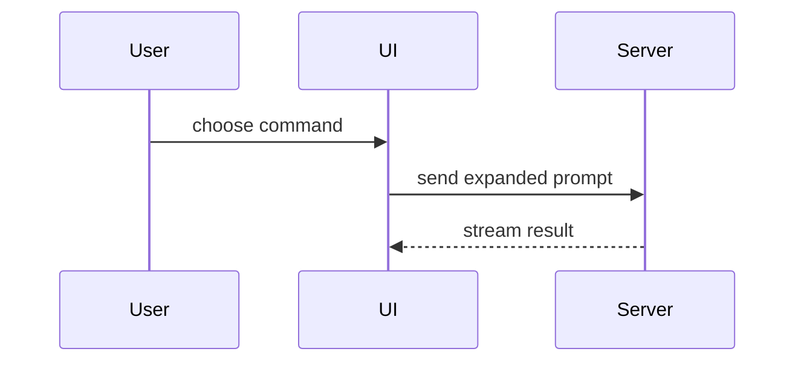

# Summary visuals

The forms for the Summary visual of the [`pull-requests`](SKILL.md) skill. Pick one. Pick a second only when the first cannot show the main point alone.

## Pseudocode, for logic or an algorithm

```text
on(save)
  if content is unchanged
    return cached result
  write new content
  return fresh result
```

## A call tree, for runtime control flow

```text
submitForm
  createSession
    persistPrompt
    launchAgent
  navigateToSession
```

## A component tree, for UI structure

Include the state and the module boundaries that matter.

```text
<SessionPage>            routes/session.tsx
  useSessionEvents()
  <SessionToolbar>
    <RunSkillButton>     packages/ui
```

## A file tree, for file ownership or a broad refactor

Keep it shallow.

```text
src/
├── commands/       # parses user actions
├── sessions/       # owns session state
└── transport/      # sends API requests
```

## A Mermaid diagram, for interaction or data flow between parts



## A diff sketch, for a change to a shape that already exists

Match the shape of the diff to the topic.

A component change:

```diff
 <SessionPage>
   useSessionEvents()
   <SessionToolbar>
+    <RunSkillButton />
   <SessionTimeline>
+    <SkillResultCard />
```

A file layout change:

```diff
 src/
 ├── commands/
+│   └── show-me.ts       # expands the slash command
 ├── sessions/
-└── transport.ts
+└── transport/
+    ├── client.ts
+    └── stream.ts
```

A call tree change:

```diff
 submitForm
   createSession
     persistPrompt
+    expandSkillMention
     launchAgent
   navigateToSession
+    subscribeToEvents
```

A state or control flow change:

```diff
 on(save)
-  write content
+  if content is unchanged
+    return cached result
+  write new content
+  invalidate cache
```

## A whole block, for new code

Show the whole block when most of it is new, when a cut would hide ownership or order, or when the reviewer needs a target shape to copy.

```ts
function expandSkill(command: string): string {
  const skillName = command.slice(1)
  return `use the ${skillName} skill`
}
```
